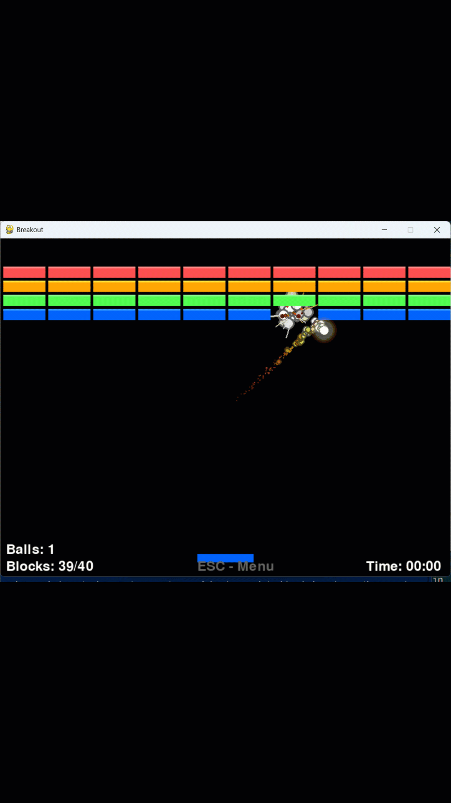

# 🎮 Breakout Game - Progressive Tutorial Series

Welcome to the **Breakout Game Tutorial Series**! 🚀 This project takes you on an exciting journey from a simple bouncing ball to a full-featured game with explosive effects and high scores! 💥



## Repo link

- [https://gh.io/rd-breakout](https://gh.io/rd-breakout)    
- [game assets](https://gh.io/game-assets)

## 🎯 What You'll Build

Each part builds upon the previous one, teaching you game development concepts step by step:

### 🏓 Part 1 (`main.py`) - The Humble Beginning
- **Just a bouncing ball!** 🏀
- Learn basic Pygame setup
- Understand game loops and rendering
- Simple physics with wall collisions

### 🧱 Part 2 (`part2.py`) - Enter the Blocks!
- **Now we're cooking!** 👨‍🍳
- Add colorful blocks to destroy
- Implement collision detection
- Create the classic breakout gameplay

### ⭐ Part 3 (`part3.py`) - Level Up the Experience
- **Getting fancy!** ✨
- Enhanced game mechanics
- Better graphics and effects
- Improved player experience

### 🎨 Part 4 (`part4.py`) - Visual Spectacular
- **Eye candy galore!** 🍭
- Particle effects and trails
- Multiple balls system
- HUD with score and stats
- Game menu with high scores

### 💥 Part 5 (`part5.py`) - The Ultimate Experience
- **EXPLOSIVE FINALE!** 🎆
- Explosive balls with blast radius
- Comet trails and fiery particle effects
- Complete high score system with CSV storage
- Professional game menu and credits
- Multi-ball madness with bonus spawns

## 🚀 Installation & Setup

### Prerequisites
- Python 3.12 or higher 🐍
- That's it! We'll handle the rest 😎

### Quick Start (Recommended)
```bash
# 1. Clone or download this project 📦
# 2. Navigate to the breakout folder 📁
cd breakout

# 3. Install dependencies (pygame will be installed automatically!) 🎮
pip install -e .

# 4. Start your journey! Choose any part to run:
```

### 🎮 Running the Games

#### 🏓 Start Simple - The Bouncing Ball
```bash
python main.py
```
*Just watch that ball bounce! Use arrow keys to move the paddle.* 

#### 🧱 Classic Breakout Action
```bash
python part2.py
```
*Now you can actually break blocks! Left/Right arrows to move, space to start.*

#### ⭐ Enhanced Experience
```bash
python part3.py
```
*More features and polish!*

#### 🎨 Visual Feast
```bash
python part4.py
```
*Prepare for particle effects and multi-ball action!*

#### 💥 Ultimate Breakout Experience
```bash
python part5.py
```
*The full experience with explosive balls and complete game systems!*

### Alternative Installation (If you prefer manual setup)
```bash
# Install pygame manually
pip install pygame>=2.6.1

# Then run any part you want!
python part5.py
```

## 🎮 Game Controls

- **⬅️ ➡️ Arrow Keys**: Move paddle
- **🚀 Spacebar**: Launch ball (in later parts)
- **⏸️ ESC**: Game menu (in advanced parts)
- **🖱️ Mouse**: Navigate menus

## 🏆 Features by Part

| Part | Bouncing Ball | Blocks | Paddle Control | Particles | Multi-Ball | High Scores | Explosions |
|------|:-------------:|:------:|:--------------:|:---------:|:----------:|:-----------:|:----------:|
| 1    | ✅            | ❌     | ✅             | ❌        | ❌         | ❌          | ❌         |
| 2    | ✅            | ✅     | ✅             | ❌        | ❌         | ❌          | ❌         |
| 3    | ✅            | ✅     | ✅             | ⭐        | ❌         | ❌          | ❌         |
| 4    | ✅            | ✅     | ✅             | ✅        | ✅         | ✅          | ❌         |
| 5    | ✅            | ✅     | ✅             | ✅        | ✅         | ✅          | 💥         |

## 🎯 Learning Path

**Recommended order for learning:** 📚

1. **Start with `main.py`** - Understand the basics
2. **Move to `part2.py`** - See how game mechanics work
3. **Progress through parts 3-4** - Learn advanced features
4. **Master `part5.py`** - Experience the full game

Each file is self-contained, so you can jump to any part that interests you! 🎪

## 🐛 Troubleshooting

### Pygame won't install?
```bash
# Try upgrading pip first
python -m pip install --upgrade pip
pip install pygame
```

### Game window too small/big?
Edit the `WIDTH` and `HEIGHT` variables at the top of any file! 📐

### No sound? 
That's normal! This tutorial focuses on graphics and gameplay mechanics. 🔇

## 🎉 Have Fun!

Remember, the best way to learn is by experimenting! Try modifying the code:
- Change ball speed 🏃‍♂️
- Add more block colors 🌈
- Modify particle effects ✨
- Create new ball types 🎈

**Happy coding and gaming!** 🎮✨

---
*Made with ❤️ and lots of ☕ for aspiring game developers!*